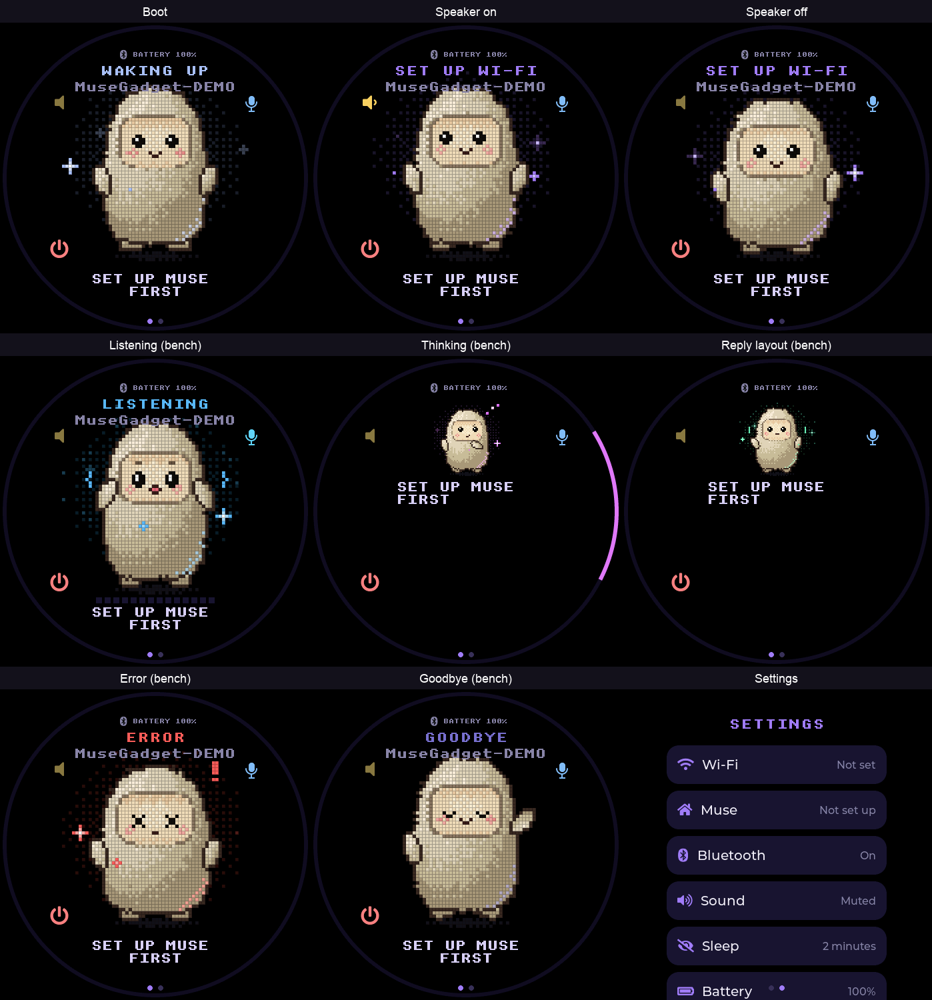

# StopWatch control validation

Device framebuffer captures for the icon-only StopWatch controls, with USB at the bottom:

- Top-right blue key: microphone / PTT and pairing confirmation.
- Top-left yellow key: speaker toggle, with sound-wave and muted icons.
- Bottom-left red key: power / screen sleep-wake and hold-to-shutdown.

The icons remain beside the physical keys on the face and reply layouts. Settings hides them so they do not cover controls. Status/name text is inside the round display's safe chord.

These are **real framebuffer snapshots from the attached board**, captured with ESP-IDF 6.0.1 bench firmware. The 3x serial snapshots were reduced to the original 466x466 resolution with nearest-neighbor resampling. The sheet only adds headings around the unchanged framebuffers.

Boot, listening, thinking, reply-layout, error, and goodbye modes were selected with `>face=`. They demonstrate rendering, **not a real conversation, microphone capture, pairing, or confirmed PMIC shutdown**. `>ui=settings` selects the real settings tile; `>speaker=0/1` selects the stored speaker setting. A bench-only `>ui.demo=1` replaces the displayed gadget name with `MuseGadget-DEMO` without changing BLE identity or provisioning. No owner photo, hardware identifiers, credentials, or firmware binaries are included.

Reproduce with `MUSE_BENCH=1 tools/muse/board.sh build stopwatch` and the serial hooks described in `esp32/devices/README.md`; use `tools/muse/snap.py` sequentially with one serial consumer.

## Automated checks

- Full host suite: 210 tests passed, zero skips; includes 12 compiled production-code StopWatch control/input/UI/settings regressions.
- ESP-IDF 6.0.1 bench and non-bench StopWatch builds: app fits the 4 MiB slot with 48% free; bootloader 66% free.
- Attached-board boot reaches `muse: ready` with 8 MiB PSRAM and the 466x466 UI.

## Hardware validation limits

Physical key presses, touch navigation, audible playback, app pairing, and red-key PMIC shutdown require separate manual confirmation. Serial-selected UI modes and host fakes do not prove those behaviors.

An intermittent panic reboot was observed during one MP3 bench attempt that also included unsolicited PTT input events and a changed speaker setting. The native USB disconnect lost the backtrace. An isolated repeat completed successfully; this is **not a root-cause fix claim**. The PR remains draft pending further physical-control and panic validation.
