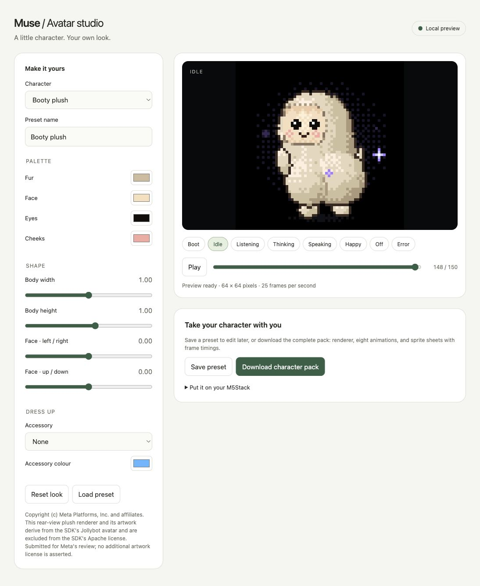

<!-- Copyright (c) Meta Platforms, Inc. and affiliates. -->

# Booty plush — rear-view example

A cream plush character in a rear three-quarter pose, with rounded hips and
an over-the-shoulder face. Derived from the SDK's Jollybot renderer. The pose
preserves boot, idle, listening, thinking, speaking, happy, off, and error,
including continuous live-speech motion and pet reactions.




Select **Booty plush** in the [local avatar studio](../../../tools/muse/CUSTOMIZER.md),
or install the included preset from `esp32/`:

```sh
python3 tools/muse/customize.py --preset avatar/packs/plush-rear/preset.json --install
```

Then build/flash your own board with the existing board tools. `sprites/`
contains all eight native 64x64 animation atlases, including glow and shadows.
Its manifest gives frame count, dimensions, grid layout, 40 ms timing, and
one-shot/loop hints. Generate a fresh full pack (including eight GIFs) with:

```sh
python3 tools/muse/customize.py --preset avatar/packs/plush-rear/preset.json --out plush-rear.zip
```

## Artwork review

The renderer and exported artwork retain Meta's copyright notice and are
Jollybot derivatives. The SDK's Apache license does not cover Jollybot, and
this example does not assert a new license for its derivatives. The character
is proposed upstream for Meta to accept, revise, or remove independently of
the customizer tooling. No reference photograph or user credentials are included.
