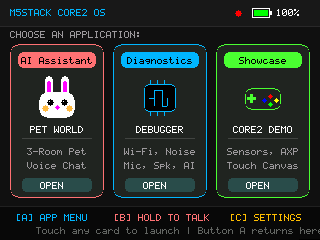
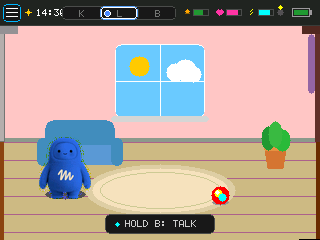
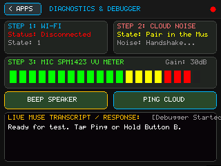
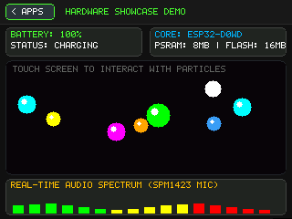

<!--
Copyright (c) Meta Platforms, Inc. and affiliates.

Licensed under the Apache License, Version 2.0 (the "License");
you may not use this file except in compliance with the License.
You may obtain a copy of the License at

    http://www.apache.org/licenses/LICENSE-2.0

Unless required by applicable law or agreed to in writing, software
distributed under the License is distributed on an "AS IS" BASIS,
WITHOUT WARRANTIES OR CONDITIONS OF ANY KIND, either express or implied.
See the License for the specific language governing permissions and
limitations under the License.
-->

# M5Stack Core2 multi-app demo

An optional touch UI for the M5Stack Core2 that replaces the avatar face with a
small launcher and three example apps. It is meant as a worked example of
building a custom interface on the board's display while the normal Muse voice
session keeps running underneath — the apps only *read* `muse_state` (mode,
audio level, caption), so push-to-talk, pairing and the cloud session are
unchanged.

Enable it with `CONFIG_MUSE_APPS_DEMO` (off by default), or build with the
overlay below. Without it the board shows the standard avatar UI.

## The apps

| Launcher | Pet World |
|---|---|
|  |  |
| Three cards with pixel-art icons, battery gauge and Wi-Fi dot. Tap a card to open; Button A returns here. | An animated pet across three rooms with day/night lighting and speech bubbles driven by the voice session. |

| Diagnostics Debugger | Hardware Showcase |
|---|---|
|  |  |
| Wi-Fi / Noise session status, a live 20-segment mic VU meter, a speaker beep and a cloud ping. | AXP192 battery/power telemetry, a touch physics particle canvas, and a 16-band audio spectrum. |

## Build

Load the demo overlay after the board overlay:

```sh
idf.py -DIDF_TARGET=esp32 \
  -DSDKCONFIG_DEFAULTS="sdkconfig.defaults;devices/sdkconfig.muse;devices/sdkconfig.muse-m5stack-core2;devices/sdkconfig.muse-m5stack-core2-demo" \
  build flash
```

## How it fits

The apps (`app_manager.c`, `apps/`, `avatar/pet_world.c`) draw into a single
320x240 RGB565 framebuffer. `muse_apps_demo.c` binds that buffer to a
full-screen LVGL canvas, forwards touch to the app manager, and re-renders on
the board's frame timer. `muse_ui_start()` calls `muse_apps_demo_start()`
instead of building the avatar when `CONFIG_MUSE_APPS_DEMO` is set, so the
avatar path and every other board are untouched.
