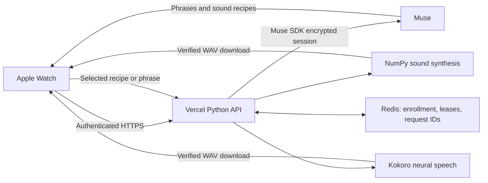

# Muse Calm for Apple Watch

A standalone watchOS 11+ meditation example. Muse writes gentle phrases and
directs changing background textures; a Python backend on Vercel synthesizes
the sound and neural speech. No iPhone companion app is required.

Choose a 1-, 5-, 10- or 20-minute session, an ASMR mix or individual texture,
one of two English voices, and a phrase interval. Settings use full-screen
lists with wrapping labels. Sound and voice volumes are independent.

- Background sounds: fresh **procedural CPU synthesis**, directed by bounded
  Muse recipes. They are not generated by a learned audio model.
- Spoken phrases: Muse text rendered by **Kokoro-82M**, using `af_heart` or
  `af_nicole` on Vercel CPU. No watch system-speech fallback.
- Startup: previously downloaded audio can play while fresh material loads.
  The first session needs a download. A verified local library, capped at
  1 GiB between sessions, persists across launches.
- Playback: fresh 60-second stereo segments, four-second crossfades, and
  quieter background sound under speech. Voices never overlap themselves.
- Stop: ending a session, an audio interruption, headphone disconnection or
  the system Pause action cancels local requests and playback. Already-running
  server work may still finish; late responses cannot restart playback.

See [how the background sound is generated](SOUND_GENERATION.md) for the recipe,
synthesis and playback pipeline. See [Vercel and Redis setup](Cloud/README.md)
for deployment, enrollment, credentials, verification and rollback.



The watch uses its available network, including the paired phone's normal
internet proxy. This is user-started background audio, not APNs or unsolicited
playback. Headphones preserve stereo detail. watchOS selects the output route.

## Build

Install Xcode with watchOS support and XcodeGen. Select Xcode using
`xcode-select`, or set `DEVELOPER_DIR` to your Xcode's `Contents/Developer`.
The project has no dependencies on sibling personal apps.

```sh
cd watchos-meditation
bash scripts/test.sh
xcodegen generate
xcodebuild -project MuseCalm.xcodeproj -scheme MuseCalm \
  -configuration Debug -destination 'generic/platform=watchOS' \
  -derivedDataPath build CODE_SIGNING_ALLOWED=NO build
```

For your watch, first complete the backend setup, including the private
`Watch/CloudBootstrap.json`. Generate the project **after** creating this file
so Xcode includes it. Open `MuseCalm.xcodeproj`, select your signing team and a
unique bundle identifier, select your watch and run. No development team or
personal backend address is committed.

The bootstrap contains only your backend address and watch bearer key. On first
use the app imports it into its own Keychain. Redis and Muse credentials stay
on the server. This is personal development provisioning: do not distribute a
signed app containing your bootstrap to other people. Keychain credentials take
precedence over the bootstrap on subsequent launches; changing the bundled file
alone does not rotate an already-provisioned app's key.

## Behavior when generation is slow

The app buffers up to three sounds and three phrases. Saved opening recordings
rotate between sessions and are not looped within a session. New downloads
replace queued saved material. If generation falls behind and the queue empties,
playback pauses rather than looping an old recording. Transient audio failures
get bounded retries with backoff and respect `Retry-After`. **Retry audio**
requests new material explicitly. New sounds and words require internet access;
saved startup audio can play offline.

The session clock starts when the first sound plays. Phrases default to every
15 seconds, with 30-second, one-minute and sounds-only choices. In sounds-only
mode no Muse guide is requested; the renderer uses default recipes. Procedural
textures are approximations of the named materials, not field recordings.

## Verification and source layout

- `Shared/`: recipe parsing, buffering policy, cache metadata and wire protocol.
- `Watch/`: SwiftUI controls, HTTPS clients and audio playback.
- `Cloud/`: deployable FastAPI function, procedural synthesizer, Kokoro and
  the scoped Muse SDK transport snapshot.
- `scripts/probe-guide.py`: sends the exact guide prompt through your backend.
- `scripts/probe-audio.py`: generates two distinct sounds and both voices,
  verifies checksums and saves audition WAVs under ignored `build/live-audio/`.

Run the probes only after provisioning; they use your private watch bootstrap
and consume backend/Muse resources. `bash scripts/test.sh` also validates a
saved guide response when `build/live-guide.txt` exists. See [TESTING.md](TESTING.md)
for release verification and device limitations.

## Models and licenses

Sound synthesis is implemented here in NumPy. Speech uses
[kokoro-onnx](https://github.com/thewh1teagle/kokoro-onnx) and
[Kokoro-82M](https://huggingface.co/hexgrad/Kokoro-82M); weights are fetched at
runtime and are not included in this repository. Upstream dependencies and
models retain their licenses. The copied Muse transport keeps its source
copyright notices and [Apache license](Cloud/LICENSE-SDK).

Earlier local experiments used a public Stable Audio demo, but that generator,
its recordings and its GPU dependency are not included in this example.
